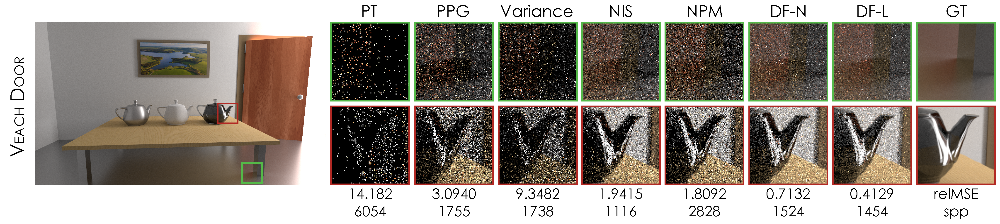
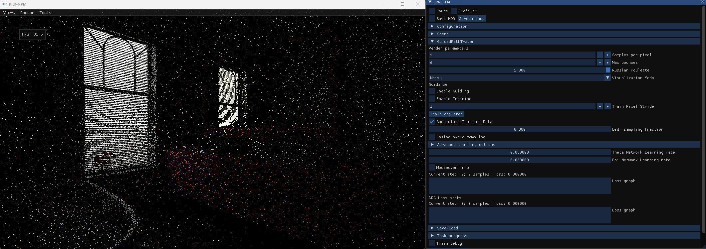

# Neural Path Guiding with Distribution Factorization

### [Paper](https://arxiv.org/pdf/2506.00839) | [Project Page](https://pedrovfigueiredo.github.io/projects/pathguiding/EGSR_2025_Importance_Sampling/index.html)

This is the official implementation of the paper, titled "Neural Path Guiding with Distribution Factorization", presented at EGSR 2025.

 <br/>
Distribution Factorization (DF) factorizes the 2D directional distribution as a product of two 1D PDFs for efficient path guiding.
We show an equal-time comparison of our method against existing approaches for the Veach Door scene. Specifically, we compare against PT (unidirectional path tracing), PPG [Müller et al. 2017], Variance [Rath et al. 2020], NIS [Müller et al. 2019], and NPM [Dong et al. 2023]. As seen, the two interpolation variants (nearest neighbor and linear interpolation) of our method produce images with significantly lower noise.

## Abstract
In this paper, we present a neural path guiding method to aid with Monte Carlo (MC) integration in rendering. Existing neural methods utilize distribution representations that are either fast or expressive, but not both. We propose a simple, but effective, representation that is sufficiently expressive and reasonably fast. Specifically, we break down the 2D distribution over the directional domain into two 1D probability distribution functions (PDF). We propose to model each 1D PDF using a neural network that estimates the distribution at a set of discrete coordinates. The PDF at an arbitrary location can then be evaluated and sampled through interpolation. To train the network, we maximize the similarity of the learned and target distributions. To reduce the variance of the gradient during optimizations and estimate the normalization factor, we propose to cache the incoming radiance using an additional network. Through extensive experiments, we demonstrate that our approach is better than the existing methods, particularly in challenging scenes with complex light transport.


## News
- **2025.06.25**: Paper is presented at EGSR 2025.
- **2025.06.26**: Repo is released.
- **2025.07.12**: Source code is released.

## Dependencies
- NVIDIA GPU (Turing or higher, with ray tracing support)
- OptiX 7.0+ and CUDA 12+

This project is tested with OptiX 7.4, CUDA 12.4, NVIDIA RTX 3080, on Windows 11 (MSVC).

## Scenes
You can download the seven scenes used in the main comparisons from the following link: [assets download](https://drive.google.com/file/d/1syGrSOc3R82RccOeCLiPx-p1dRh-K1pH/view?usp=sharing).
Once downloaded, extract the scenes into the `common` directory, so that the directory structure looks like this:
```
common/
|── assets/
|   ├── scenes/
|   ├── textures/
```

## Building

This project uses CMake to build, no additional setting is needed.

Please make sure cuda is installed and added to PATH. While it tries to guess the optix installation path (i.e., the default installation directory on Windows), you may specify the `OptiX_INSTALL_DIR` environment variable manually in case it failed.

## Running
We provide helper scripts to run the code.

### Interactive mode
 <br/>

To run the interactive mode, you can execute:
```bash
python scripts/run_interactive_cmd.py
```
This will start the interactive renderer, where you can start and stop training, visualize normals, albedo, etc. 
You can also move the camera around the scene with WASD.
To visualize the trained distribution (both DF and the underlying NRC objective) at the current mouse position, select "Mouseover info".
Frames are not accumulated in this mode. For accumulating frames, see the offline mode below.

### Offline mode
To run equal-time or equal-spp experiments, you can execute:
```bash
python scripts/run_experiments_cmd.py
```

In the script, you can specify the scene(s) to run multiple ones in sequence by modifying `test_scenes`. Command-line options include:
- `--exe`: Path to the executable (default: `./build/src/Release/testbed.exe`)
- `--method`: Method name (default: `guiding_df`). See existing method configurations in the `common/configs/render` directory.
- `--bounce`: Maximum path length (default: `6`)
- `--bsdf_fraction`: BSDF/Guided sampling ratio (default: `0.3`)
- `--train_budget_spp`: Budget percentage for training in SPP (default: `0.33`)
- `--train_budget_time`: Budget percentage for training in time (default: `0.3`)
- `--budget_type`: Budget type (either `spp` or `time`, default: `spp`)
- `--budget_value`: Budget value (default: `1000`)
- `--n_runs`: Number of runs for each scene (default: `1`)
- `--experiment_name`: Experiment name (default: empty string)
- `--image_save_pass_interval`: Save image every n passes (default: `-1`, meaning it does not save intermediate images)

Results are saved in the `common/outputs` directory.


### Reference images
To render path-tracing reference images, you can execute:
```bash
python scripts/run_reference_cmd.py
```
This script takes similar command-line options as the offline mode. See the script for details.
Note that rendering references may take several hours or even days, depending on the scene and resolution.

### Additional settings
You are welcome to investigate the different options under the `src/render/guided/parameters.h` configuration file. Some of the notable options include:
- `OPTIMIZE_ON_NRC`: Turn NRC optimization on or off, or only use NRC for Li or Ls (see ablations in the paper), or even use NRC for N-step optimization instead of 1-step like done in the paper. By default, we use NRC for both Li (1) and Ls (3) = 4 (1 + 3).
- `AR_LINEAR_INTERPOLATION`: Toggle between nearest neighbor and linear interpolation. Defaults to linear interpolation (1).
- `RENDER_NOISY_ONLY`: Turn off UI and mouseover visualizations to achieve better performance in offline mode (we set this to 1 to match the numbers in the paper).
- `N_DIM_OUTPUT`: Set the number of output dimensions for the neural network. By default, it is set to 16x32, as done in the paper. Note that tiny-cuda-nn pads outputs to next multiple of 16.

Note that modifying a parameter requires recompilation of the code to take effect.

## Citation
If our work is useful for your research, please consider citing:
```
@inproceedings{figueiredo25guidingdf,
  booktitle = {Eurographics Symposium on Rendering},
  editor = {Wang, Beibei and Wilkie, Alexander},
  title = {{Neural Path Guiding with Distribution Factorization}},
  author = {Figueiredo, Pedro and He, Qihao and Kalantari, Nima Khademi},
  year = {2025},
  publisher = {The Eurographics Association},
  ISSN = {1727-3463},
  ISBN = {978-3-03868-292-9},
  DOI = {10.2312/sr.20251178}
}
```

## Acknowledgements
This project was funded in part by the NSF CAREER Award #2238193.
This project is built upon the following open-source projects:
- [Neural Parametric Mixtures for Path Guiding](https://github.com/neuropara/neural-mixture-guiding)
- [tiny-cuda-nn](https://github.com/NVlabs/tiny-cuda-nn)